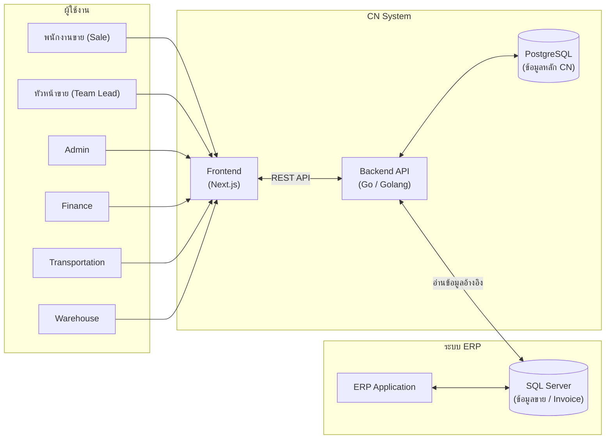
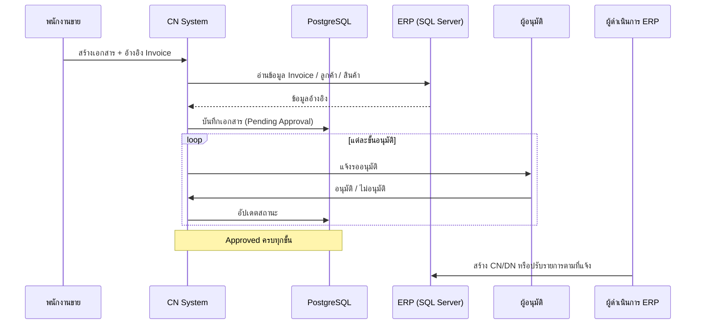

# Credit Note Management System (CN System)

**AMERICAN-EUROPEAN PRODUCTS CO., LTD.**

ระบบจัดการเอกสาร Credit Note / Debit Note และเอกสารที่เกี่ยวข้องกับการปรับปรุง/ยกเลิกรายการขาย ทำหน้าที่เป็น **ชั้นกลาง (Pre-ERP Workflow)** ก่อนดำเนินการจริงในระบบ ERP

---

## 1. วัตถุประสงค์ของระบบ

ระบบ CN ถูกออกแบบมาเพื่อ **ซัพพอร์ตระบบ ERP** ไม่ใช่แทนที่ ERP โดยตรง

| ปัญหาที่แก้ | วิธีที่ระบบช่วย |
|-------------|----------------|
| เซลล์ต้องการยกเลิกบิล / ลดราคา / รับคืนสินค้า / แจ้งปัญหาการส่ง | สร้างเอกสาร CN พร้อมเหตุผล รายการสินค้า และหลักฐานแนบ |
| หลายฝ่ายต้องรับทราบก่อนแก้ใน ERP | ส่งเข้ากระบวนการอนุมัติตาม role ที่เกี่ยวข้อง |
| ข้อมูลอ้างอิงจากบิลขายต้องถูกต้อง | ดึงข้อมูล Invoice จาก ERP (SQL Server) มาแสดงและเลือกรายการ |
| ต้องมีหลักฐานและลำดับการอนุมัติ | บันทึกประวัติอนุมัติ ลายเซ็น สถานะ และเอกสารแนบใน PostgreSQL |

**หลักการสำคัญ:** เอกสารที่ **Approved ครบทุกขั้น** จึงถือว่าทุกฝ่ายรับทราบและเห็นชอบแล้ว — จากนั้นทีมที่รับผิดชอบ ERP จึงดำเนินการสร้าง CN/DN หรือปรับรายการใน ERP ตามที่แจ้ง

---

## 2. สถาปัตยกรรมระบบ



### 2.1 ชั้น Frontend

| รายการ | รายละเอียด |
|--------|------------|
| Framework | Next.js (App Router) |
| UI | React — หน้าจอ CN System สำหรับเซลล์และผู้อนุมัติ |
| หน้าที่ | สร้างเอกสาร, ติดตามสถานะ, อนุมัติ, พิมพ์/Export PDF, จัดการโปรไฟล์ |

> **หมายเหตุ (repo นี้):** โปรเจกต์ `mock/frontend` เป็น **เวอร์ชัน Demo** ใช้ Mock Data ใน localStorage สำหรับแสดงผลงาน ไม่เชื่อม Backend จริง และเปิดใช้งานได้ทันทีในสิทธิ์ Sale

### 2.2 ชั้น Backend (Go)

| รายการ | รายละเอียด |
|--------|------------|
| ภาษา | Go (Golang) |
| หน้าที่ | Authentication, Business Logic, Workflow อนุมัติ, จัดการไฟล์แนบ |
| API | REST — เช่น `/api/auth/login`, `/api/cn-documents`, `/api/cn-lookups` |
| การเชื่อม ERP | Query ข้อมูล Invoice / ลูกค้า / สินค้า จาก **SQL Server** ฝั่ง ERP |

### 2.3 ฐานข้อมูล

| ระบบ | ประเภท | บทบาท |
|------|--------|--------|
| **PostgreSQL** | ฐานข้อมูลหลักของ CN | เก็บเอกสาร CN, รายการสินค้า, สายอนุมัติ, ผู้ใช้, ลายเซ็น, ไฟล์แนบ |
| **SQL Server** | ฐานข้อมูล ERP | อ่านข้อมูลอ้างอิง (Sale Invoice, ลูกค้า, รายการสินค้า) — **ไม่เขียนทับ ERP โดยตรงจาก CN** |

---

## 3. ประเภทเอกสาร

ระบบรองรับเอกสารหลัก 5 ประเภท แต่ละประเภทมี **ลำดับการอนุมัติต่างกัน**

| ประเภทเอกสาร | คำอธิบายโดยย่อ |
|--------------|----------------|
| เอกสาร CN ราคาสินค้า | แจ้งลดราคา / ปรับมูลค่าบิลขาย (Credit Note ด้านราคา) |
| เอกสาร DN ราคาสินค้า | แจ้งเพิ่มราคา / ปรับมูลค่า (Debit Note ด้านราคา) |
| เอกสารรับคืนสินค้า | แจ้งรับคืนสินค้าจากลูกค้า |
| เอกสารตามเปลี่ยน - รับคืนสินค้า | กรณีเปลี่ยนสินค้าและมีการรับคืน |
| เอกสารตามส่งสินค้า | กรณีปัญหาการจัดส่ง / ขาดส่ง / ตามส่ง |

### เหตุผลการขอทำ (ตัวอย่าง)

- สินค้าชำรุด
- สินค้าหมดอายุ
- ขาดส่งสินค้า
- ส่งสินค้าผิด

---

## 4. กระบวนการอนุมัติ (Approval Workflow)

แต่ละประเภทเอกสารมีสายอนุมัติเฉพาะ เพื่อให้ฝ่ายที่เกี่ยวข้อง **รับทราบก่อน** การดำเนินการใน ERP

### 4.1 เอกสาร CN/DN ราคาสินค้า

```
พนักงานขาย → หัวหน้าขาย → Admin → Finance
```

### 4.2 เอกสารรับคืนสินค้า

```
พนักงานขาย → หัวหน้าขาย → Admin → Transportation → Warehouse → Finance
```

### 4.3 เอกสารตามเปลี่ยน - รับคืนสินค้า

```
พนักงานขาย → หัวหน้าขาย → Admin → Transportation → Warehouse
```
*(ไม่มีขั้น Finance)*

### 4.4 เอกสารตามส่งสินค้า

```
Warehouse → Transportation → หัวหน้าขาย → Admin
```
*(เริ่มจากคลังสินค้า ไม่เริ่มจาก Sale)*

### กฎการอนุมัติ

- อนุมัติได้เฉพาะ **role ที่ถึงคิว** และขั้นก่อนหน้าอนุมัติแล้ว
- **อนุมัติ** — ไม่บังคับระบุเหตุผล
- **ไม่อนุมัติ** — ต้องระบุเหตุผลทุกครั้ง → สถานะเป็น `Rejected`
- **ผู้สร้างเอกสาร** สามารถ **ปิดเอกสาร** ได้เมื่อยังอยู่ใน `Pending Approval` → สถานะเป็น `Cancelled`

---

## 5. สถานะเอกสาร

| สถานะ | ความหมาย |
|-------|----------|
| `Pending Approval` | อยู่ระหว่างรออนุมัติจากฝ่ายที่เกี่ยวข้อง |
| `Approved` | อนุมัติครบทุกขั้นแล้ว — พร้อมให้ดำเนินการใน ERP |
| `Rejected` | ถูกปฏิเสธโดยผู้อนุมัติ — ไม่ดำเนินการต่อ |
| `Cancelled` | ผู้สร้างปิดเอกสารเอง |

---

## 6. บทบาทผู้ใช้งาน (Roles)

| Role | หน้าที่หลัก |
|------|------------|
| **Sale** (พนักงานขาย) | สร้างเอกสาร, แนบหลักฐาน, ติดตามสถานะ, ปิดเอกสาร (ถ้าจำเป็น) |
| **Team Lead** (หัวหน้าขาย) | อนุมัติ/ไม่อนุมัติเอกสารของทีม |
| **Admin** | ตรวจสอบและอนุมัติในระดับระบบ |
| **Finance** | อนุมัติด้านการเงิน (CN/DN ราคา, รับคืนสินค้า) |
| **Transportation** | อนุมัติด้านการขนส่ง |
| **Warehouse** | อนุมัติด้านคลังสินค้า / รับคืน |

---

## 7. ฟีเจอร์หลักในระบบ

### 7.1 รายการเอกสาร

- แสดงรายการ CN ทั้งหมด พร้อมสรุปจำนวนตามสถานะ (6 เดือนย้อนหลัง)
- ค้นหา: เลขที่เอกสาร, ลูกค้า, พนักงานขาย
- กรอง: สถานะ, ประเภทเอกสาร, วันที่
- ผู้อนุมัติ: กรอง "รอฉันอนุมัติ"

### 7.2 สร้างเอกสาร

1. กรอก **เลขที่เอกสารอ้างอิง** (Sale Invoice จาก ERP) แล้วกดตรวจสอบ
2. ระบบดึงข้อมูลลูกค้า, พนักงานขาย, รายการสินค้าจาก ERP
3. เลือกประเภทเอกสาร, เหตุผล, รายการสินค้าที่ต้องการ CN
4. แนบรูปภาพหลักฐาน
5. บันทึก → ส่งเข้ากระบวนการอนุมัติ

### 7.3 รายละเอียดเอกสาร

- ข้อมูลเอกสารและเอกสารอ้างอิง
- รายการสินค้าและยอดรวม
- สายอนุมัติพร้อมลายเซ็น
- ไฟล์แนบ
- ปุ่มอนุมัติ / ไม่อนุมัติ / ปิดเอกสาร (ตามสิทธิ์)
- พิมพ์เอกสาร / Export PDF

### 7.4 โปรไฟล์ผู้ใช้

- แก้ไขชื่อ-นามสกุล
- อัปโหลดลายเซ็นสำหรับการอนุมัติ

### 7.5 วิธีใช้งาน

- คู่มือสั้นสำหรับผู้ใช้งานประจำวัน (ในเมนู "วิธีใช้งาน")

---

## 8. Flow การทำงานร่วมกับ ERP



**สรุป:** CN System เป็น **ช่องทางแจ้งและอนุมัติก่อน** — ERP ยังเป็นที่ดำเนินการบัญชีและสต็อกจริง

---

## 9. โครงสร้างโปรเจกต์ Frontend (Demo)

```
frontend/
├── src/
│   ├── app/
│   │   ├── page.js              # หน้าหลัก CN System
│   │   ├── layout.js
│   │   └── globals.css
│   ├── components/cn/
│   │   ├── CNSystemApp.jsx      # Shell หลัก + เมนู
│   │   ├── TopBar.jsx
│   │   ├── shared.js            # UI components, สถานะ, สีประเภทเอกสาร
│   │   └── pages/
│   │       ├── CNListPage.jsx       # รายการเอกสาร
│   │       ├── CNCreatePage.jsx     # สร้างเอกสาร
│   │       ├── CNDetailPage.jsx     # รายละเอียด + อนุมัติ
│   │       ├── CNProfilePage.jsx    # โปรไฟล์
│   │       └── CNManualPage.jsx     # วิธีใช้งาน
│   └── lib/
│       ├── mockData.js          # ข้อมูลตัวอย่าง
│       ├── mockStore.js         # Logic mock + localStorage
│       ├── cnApi.js             # API layer (mock)
│       └── cnAuth.js            # ผู้ใช้ demo (Sale)
└── CN_SYSTEM.md                 # เอกสารนี้
```

### รัน Demo

```bash
npm install
npm run dev
```

เปิด `http://localhost:3000` — เข้าใช้งานได้ทันทีในสิทธิ์ **Sale** (ไม่ต้อง Login)

---

## 10. API หลัก (Production Backend)

เมื่อเชื่อม Backend Go จริง Frontend จะเรียก API ดังนี้:

| Method | Endpoint | คำอธิบาย |
|--------|----------|----------|
| POST | `/api/auth/login` | เข้าสู่ระบบ |
| GET | `/api/cn-lookups` | ประเภทเอกสาร, เหตุผล |
| GET | `/api/cn-documents` | รายการเอกสาร (รองรับ filter, pagination) |
| GET | `/api/cn-documents/{id}` | รายละเอียดเอกสาร |
| POST | `/api/cn-documents` | สร้างเอกสารใหม่ |
| POST | `/api/cn-documents/{id}/approve-*` | อนุมัติตาม role |
| POST | `/api/cn-documents/{id}/reject` | ไม่อนุมัติ |
| POST | `/api/cn-documents/{id}/close` | ปิดเอกสารโดยผู้สร้าง |
| GET | `/api/sale-invoice-reference` | ดึงข้อมูล Invoice จาก ERP |
| GET/PUT | `/api/employees/me` | โปรไฟล์ผู้ใช้ |
| POST | `/api/employees/me/signature` | อัปโหลดลายเซ็น |

---

## 11. ข้อมูลอ้างอิง Demo

| รายการ | ค่าตัวอย่าง |
|--------|------------|
| ผู้ใช้ Demo | สมชาย ใจดี (EMP001) — Sale |
| เลข Invoice อ้างอิง | `SI2605010001`, `INV-2024-0045` |
| เอกสารตัวอย่าง | CN-2024-0001 ถึง CN-2024-0008 |
| เก็บข้อมูล Demo | `localStorage` key `cn_mock_store_v1` |

---

## 12. สรุป

Credit Note Management System เป็นระบบ Workflow กลางที่:

1. ให้ **เซลล์แจ้ง** เรื่องยกเลิกบิล ลดราคา รับคืน หรือปัญหาการส่ง — พร้อมหลักฐาน
2. ให้ **ทุกฝ่ายที่เกี่ยวข้องอนุมัติ** ตามลำดับก่อนดำเนินการ
3. ใช้ **PostgreSQL** เป็นฐานข้อมูลหลักของ CN
4. อ่านข้อมูลอ้างอิงจาก **SQL Server (ERP)** ผ่าน **Backend Go**
5. เมื่อ Approved ครบ — จึงดำเนินการใน **ERP** ตามที่แจ้ง

---

*© AMERICAN-EUROPEAN PRODUCTS CO., LTD. All rights reserved.*
